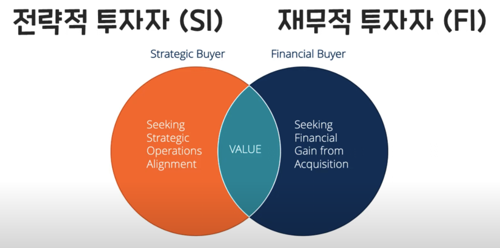
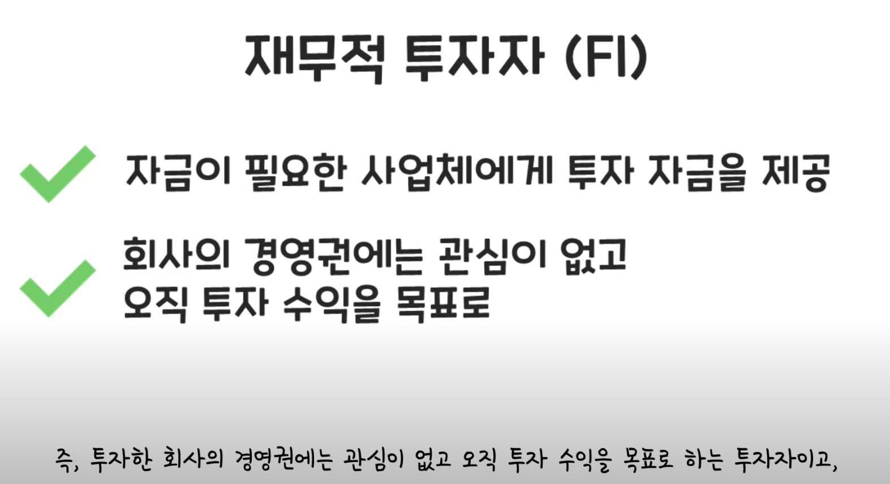
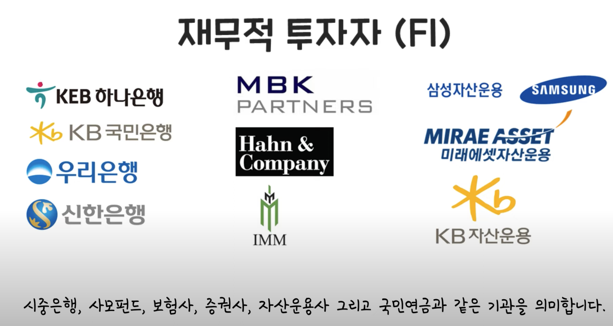
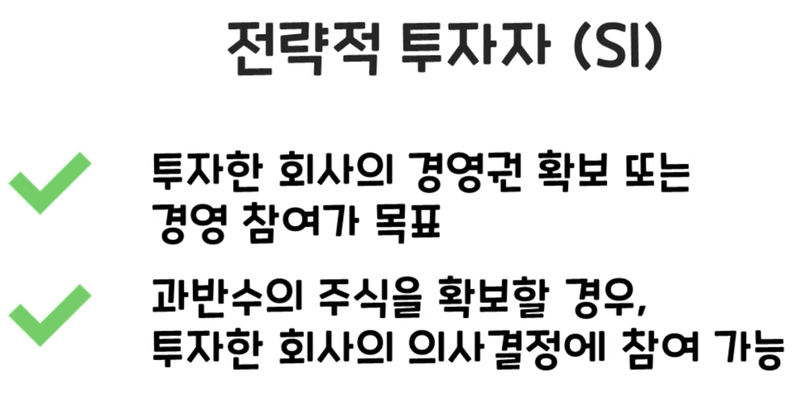

- 자금이 필요한 사업체에게 투자 자금을 제공하는 투자자이다.
- 사업의 운영에는 참여하지 않고 시세차익 실현만을 목적으로 한다.
- 즉, 투자한 회사의 경영권에는 관심이 없고 오직 투자 수익을 목표로 하는 투자자이고, 투자한 회사의 장기적인 성장보다는 투자원금과 배당 수익을 통해 원금 이상의 초과이익을 내는 데에만 목적이 있다.
- 재무적 투자자는 대체로 기관이며, 기관이라 함은 시증은행, 사모펀드, 보험사, 증권ㅅ, 자산운용사 그리고 국민연금과 같은 기관이다.
- 기관투자자, FI는 왜 회사의 미래는 1도 신경을 쓰지 않고 오직 초과이익만을 목표로 할까?
  - 투자자들이 펀드를 통해 5천만원을 가입했을 경우, 원금 이상의 추가 수익에 대한 수수료를 먹어야 한다.
  - 수수료 선취형 펀드가 아니라면 대개 이럴 경우 매출이 없기 때문이다.
  - 국민 연금도 마찬가지이다.
- FI는 Fi가 정해둔 목표수익률을 발생시켜줄 성장성이 보이는 회사 발굴을 목표로한다.
- 투자 수익 실현 후 빠지는 것이 목표이기 때문에, FI는 통상 투자할 회사의 재무제표를 상세하게 살펴보기도 한다.

- 
- 
- 전략자 투자자 SI는 돈을 필요로 하는 회사에 투자하여 자금을 조달해주고, 투자한 회사의 경영권 확보 또는 경영 참여를 목표로 한다.
- 따라서 SI는 과반수의 주식을 확보할 경우 기업의 경영을 통제하고 감시할 뿐만 아니라 투자한 회사의 전방위적인 의사결정에 참여를 할 수 있게 됩니다
  .
- 전략적 투자자 SI의 목표는, 재무적 투자자, FI의 목표와는 어떻게 다를까?
  - FI와는 달리 SI는 타겟 회사에 자금을 조달하면서 결국에는 경영권을 획득하고, SI의 메인 비즈니스에 더 큰 시너지를 창출하는 것이 목표이다.
  - 타겟 회사를 인수함으로써,SI의 주 사업의 장기적 성장을 추가로 도모하는 것이다.
  - 따라서 SI는 타겟을 흡수해서 수직적 통합 혹은 수평적 확장을 추구한다.
    - 수직 : 개발 회사가 유통회사를 인수
    - 수평 : 넷마블이 코웨이를 인수
