- 2020. 9.  09
- 1부

  - https://www.youtube.com/watch?v=GKefoHCIUbA

  - 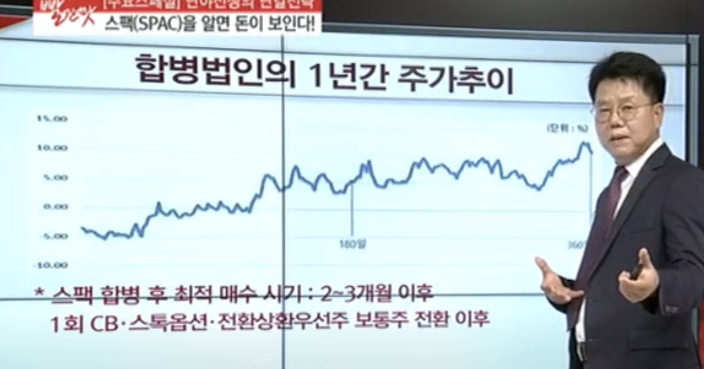
    - CB, 스톡옵션, 전환상환우선주 보통주 전환 이후의 가격을 확인한다.
  - 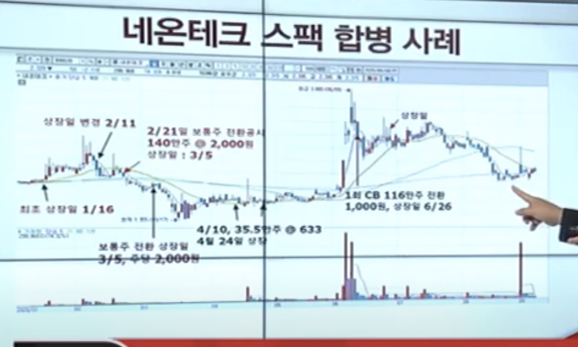

    - 상장일날 2400원 부근에서 140만주 2000원에 상장
    - 4월 10일 35.5만주 630원짜리 스톡옵션 전환청구, 상장일 4월 24일

  - 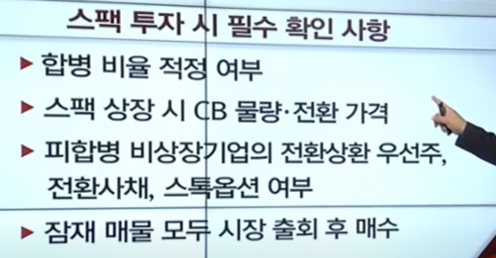

- 2부

  - https://www.youtube.com/watch?v=sY7qpplKmlw
  - 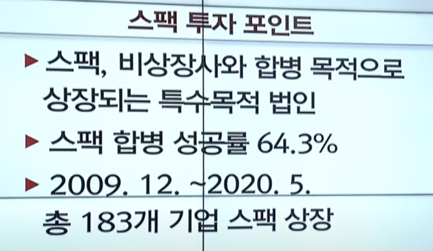
  - 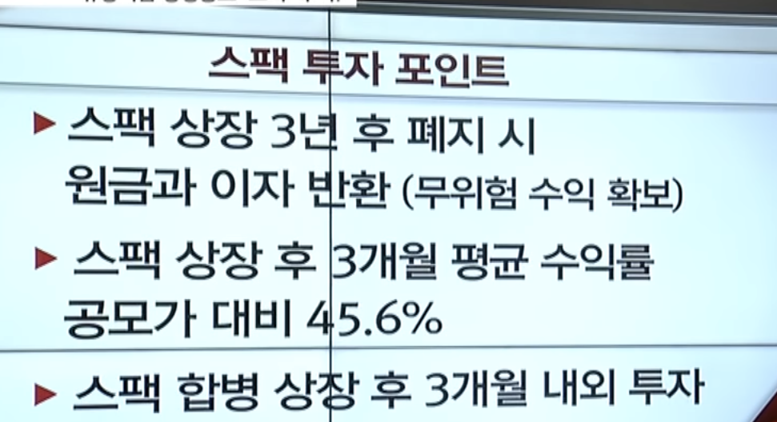
    - 전환사채, 전환상환우선주, 스톡옵션
  - 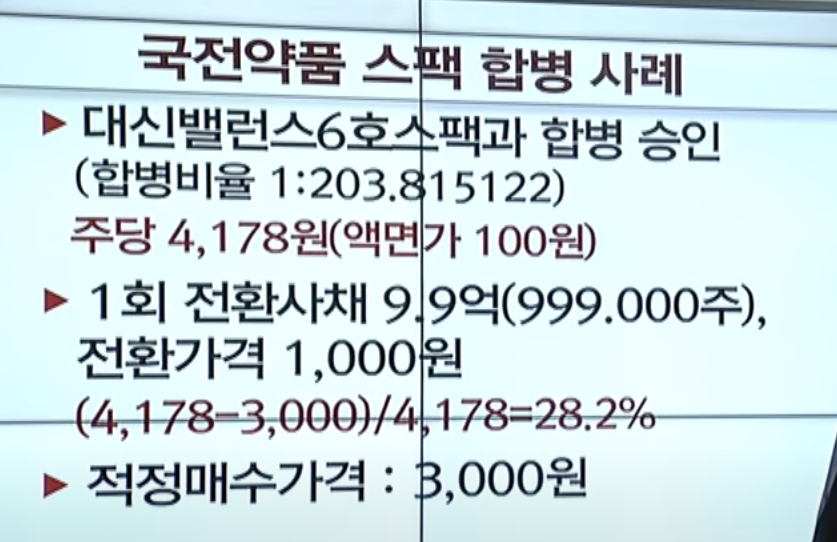
    - 국전약품1주 들고 있으면 대신밸런스6호 203 주를 받는다.
  - 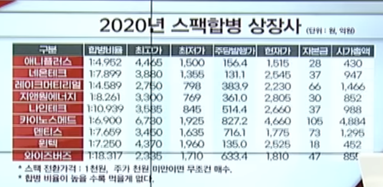
    - 합병 비율이 높은 것들은 초과수익을 얻기 쉽지 않다.
    - 증권사가 5% 이상 지분을 가져고오는 조건 이기 때문에 그들은 1,000원이다. 쭉 ~ 스팩 가격이 1천원대 초반이면 주가가 이다.
    - 전환 물량이 저가인 것들은 1천원 까지 갈 수 있다.
    - 주당발행가격의 2배수 일 경우 매수 포인트이다.
      - 주당발행가가 400원이고 스팩 가격이 800원일 경우 매수한다.
  - 합병비율

    - 합병시 합병비율을 산출하게 되서 공지를 하게 된다. 삼성스팩2호의 경우 삼성스팩2호 : (주)엔피 = 1:6.191로 결정되었다. 이는 여러 평가방법을 통해서 (주)엔피의 주식 1주의 가치가 삼성스팩2호의 6.191개와 동일하다는 의미이다. (합병가액 - 2000원 : 12,382원)즉 다시말해서 (주)엔피의 주주에게 1주당 6.191개의 주식을 주겠다는 의미이다. 합병비율을 산출할때 여러가지를 고려해서 산출하게 된다. 합병가액을 산출한 근거가 공시에 나와있으니 궁금하신 분은 확인하면 된다. 이때 합병비율에 대해서 스팩주주의 입장에서는 합병비율이 낮게 나오는 것이 유리하다. 반대로 피합병법인의 주주들은 합병비율이 높게 나오는 것을 선호한다. 예를 들어서 합병비율이 1:2일 경우 2주밖에 받지 못하기 때문에 기존 주주들의 지분율이 줄어들고 스팩주주들의 지분율이 커질 가능성이 크기 때문이다. 이러한 이유때문에 합병비율을 산정할때는 인수목적회사와 피합병법인간의 합의가 필요하다. 특례규정에 따라 협의하여 가격결정이 가능한데 아래 공시 내용중 일부 내용을 확인해보면 삼성스팩2호의 합병건의 경우에도 일반 규정의 비해 특례규정 적용에 따라서 신주발행주식수가 더 많이 발생하면서 스팩주주들의 주주가치가 훼손될 수 있다는 내용이다.

  - 
    - 잠재 매물 모두 시장 출회 후 매수 진행
  - 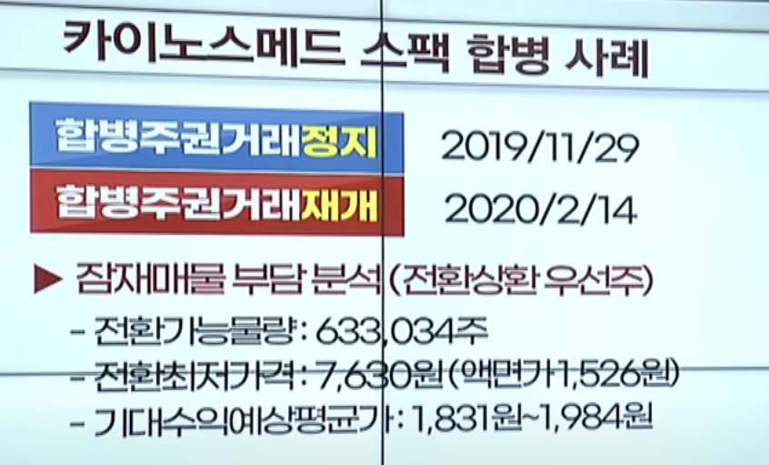
    - 전환최저가격 : 7630원 (스팩은 액면가 100원으로, 7630원을 100원 기준으로 계산하면 1526원이다)
      - 7630 / 5 = 1526원
    - 전환투자자 입장에서는 20~30% 수익률을 기대 하는것을 포인트로 하면 1831 ~ 1984원 부근이기 때문에 상장 후 기대 포인트 부근에서 인접하면 매수를 하도록 한다.
    - 스팩 합병 전 피법인 회사의 전환물량의 전환최저가격을 찾고 액면가로 나누게 되면 그것이 최저 가격이다.
  - 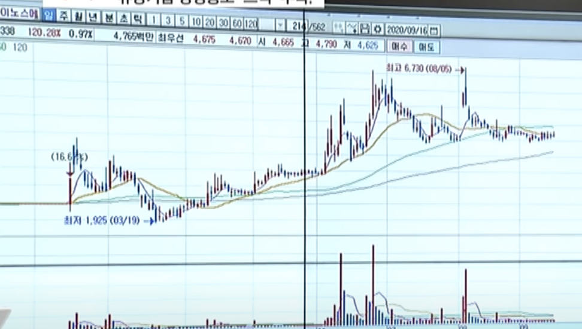
    - 밀리는 이유는 기존주주들의 물량이 나오기 때문이다.
  - 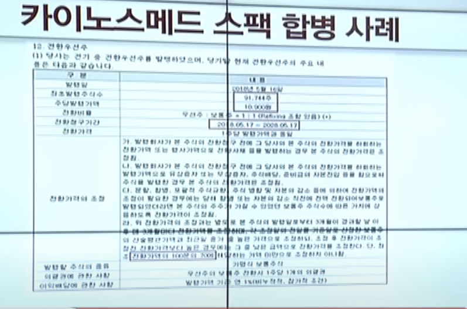
  - 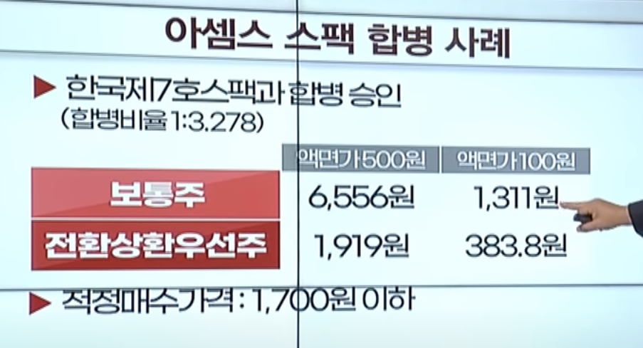
    - 이땐 보통주 기준으로 하여 1311원 기준으로 + 30% 하여 1700원 이하에서 매수 진행한다.
  - 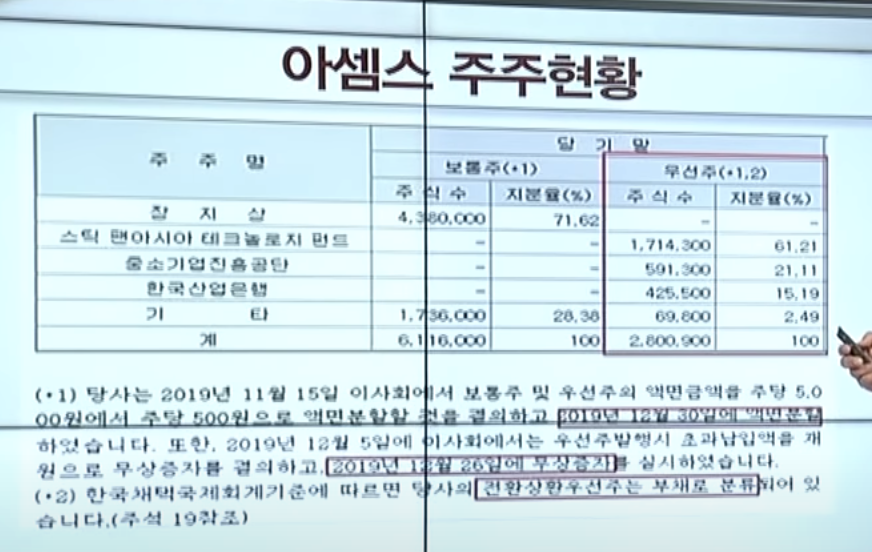
  - 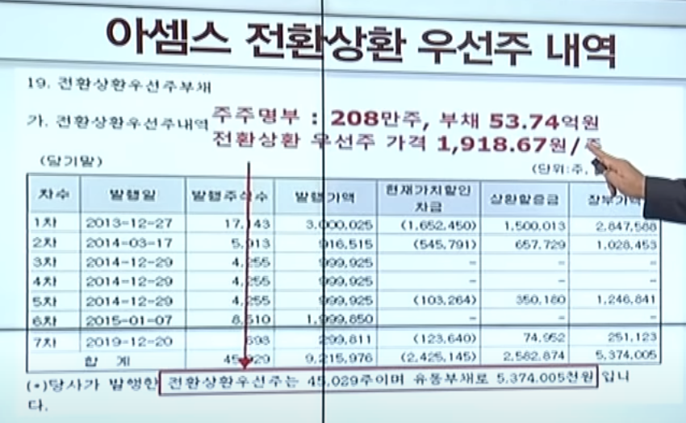
    - 5,374,005,000 / 2,800,900 = 1918원
  - 
    - 현재 주가가 높기 때문에 전환가격 1000원짜리 CB가 3000원에 팔린다고 했을때
