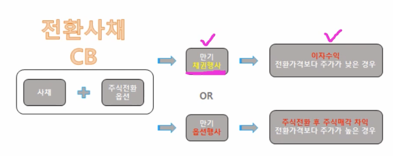
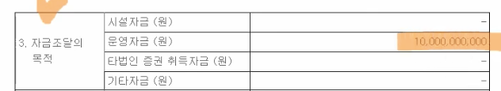
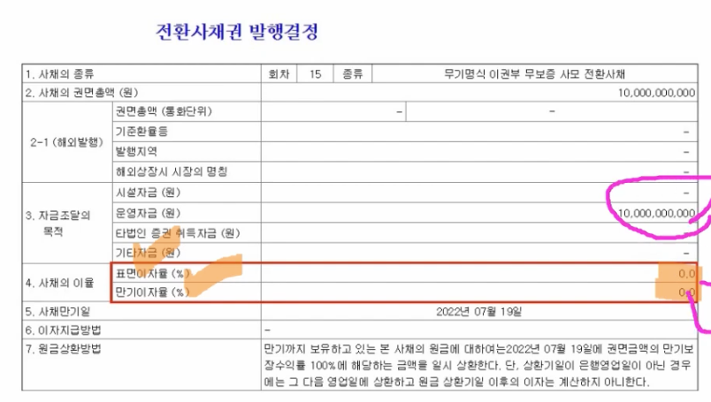

- [영상링크](https://www.youtube.com/watch?v=7wEQQOBz7RU&list=PLuTjxn6xUhzqdQtVBzFi6G4VddsaIqK8M&index=13)

- 

- 전환사채 목적 : 기업의 자금조달 목적
- 자금 조달의 목적 종류

  - 

- 전환사채의 특징

  - 

- 전환사채권 발행결정

  - 

- 이자

  - 

- 전환청구권행사
  - CB 채권을 주식으로 전환하는 것임
