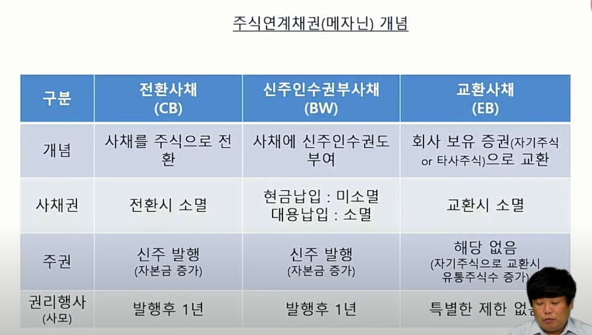
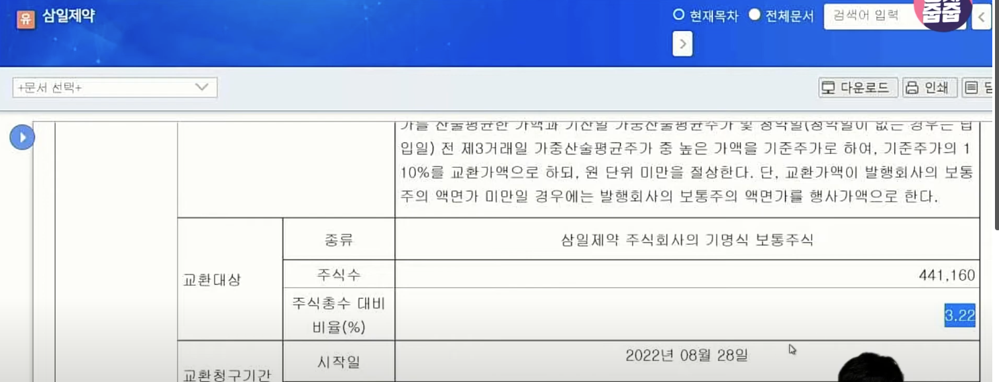

[링크](https://www.youtube.com/watch?v=wnZJT8i1RC0&list=PLuTjxn6xUhzqdQtVBzFi6G4VddsaIqK8M&index=9)

- 
  - 전환사채(CB), 교환사채(EB)의 동일한점은 채권을 주식으로 바꿀 수 있다는 점이다.
  - 전환사채(CB), 교환사채(EB) 의 다른점
    - CB는 권리행사 시 신주를 발행해서 줘야한다.
    - 교환 사채는 기존에 회사가 가지고 있는 주식(구주)를 줘야 한다.
    - 권리행사
      - CB는 발행 후 1년
      - EB는 특별한 제한이 없다. (이미 구주를 채권을 발행하는 것이기 때문이다)

- 
  - 기명식 보통주식: 삼일제약이 가지고 있는 자사주로 발행한다. (자사주 매각과 동일)
  
