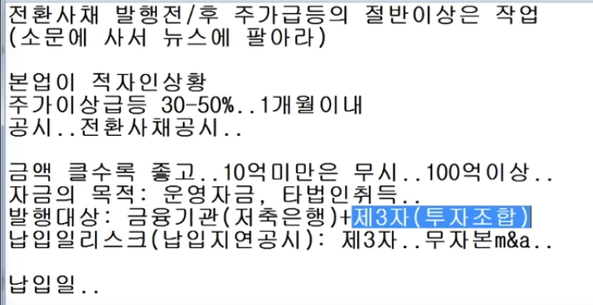

- [영상링크](https://www.youtube.com/watch?v=XEmOYYa9k9k)

- 주권 관련 사채권의 취득 결정
  - 
    - 스탠다드그래란 회사가 나노메딕스에 100억치의 채권을 발행 하였다.
- 납입 공시
  - 
  - 발행을 하고 실질적으로 넣어야 하는데 그것을 납입이라 한다.

  - 전환사채는 타법인 취득 이 좋다.

- 제 3자 배정은 1년간 보호예수 이기 때문에 1년 이 후 전환이 가능하고, 매도는 마음대로 한다 전환의기간을 묶어 놓은 것.
- 운영 자금은 별로다.