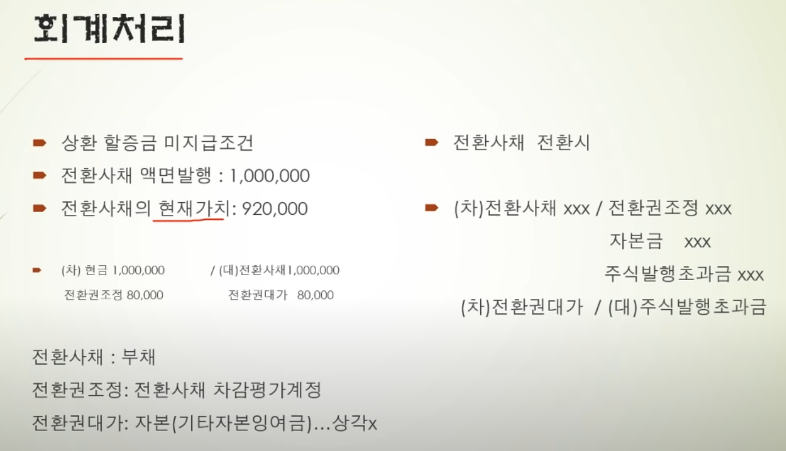
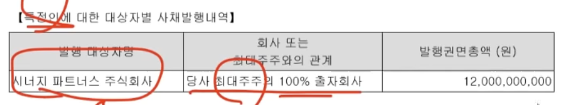
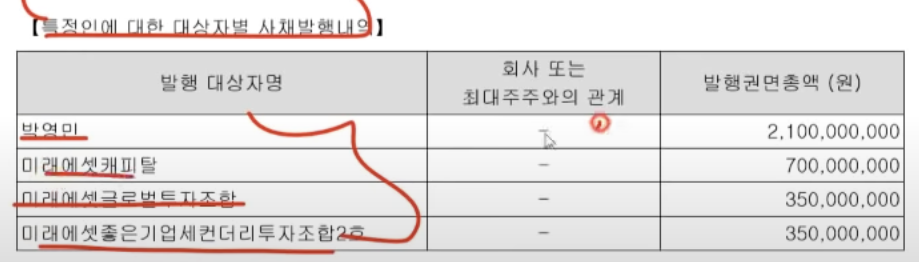

[링크](https://www.youtube.com/watch?v=wUslvixw3L4)

- 
  - 전환사채는 회사입장에서는 부채로 잡힌다.

- 차변 / 대변
  - 
  - 차변
    - 자산 
      - 자산으로 운용을 어떻게 하는 것인지
  - 대변
    - 자금조달의 원천이며 부채, 자본이 포함된다.

## 회계 처리
- 
- 전환사채의 현재가치가 920,000원 인데 1,000,000원을 받는 이유는?
  - 전환권대가
    - 주식으로 전환 할 수 있는 권리의 댓가
  - 전환권조정
    - 전환사채를 현재가치로 맞춰주기 위한 평가 계정(해마다 상각이 된다)

- 전환사채 발행의 2가지 발식
  - 사모
    - 특정인에게만 발행 (특정인)
    - 무기명 (이름이 적혀있지 않다.)
    - 이권부 : 이자율이 기록되어 있다
  - 사채의 권명총액 : 사채의 총발행 금액
  - 공모
    - 불특정 다수 발행 (대중)

## 뉴프라이드
- 전환사채를 발행을 하는 이유는?
  - 회사채나, 유상증자를 못하면 전환사채를 발행하기 때문에 사채권자들이 '갑' 입장이된다.
  - 기본적으로 회사채를 발행하기 힘들때 전환권이라는 미끼를 주면서 전환채도 주는 것이다. 
  - 유상증자 시 대주주도 돈을 납입을 해야 하는데, 이것이 어려울때
  - 현금흐름이 좋지 않다고 생각하기에, 일반적으로 악제로 작용하게 된다.
- 사채의 이율
  - 표면이자율
    - 사채를 사면 월마다 지급하는 이자
  - 만기이자율
    - 사채의 투자 수익률, 현재가치를 판단할때, 만기 이자율로 할인을 하게 된다.
- 옵션에 관한 사항
  - put option : 조기 상환을 요구 할 수 있는 옵션
- 전환권을 행사하면, 부채가 자본으로 옮겨지기 때문에 자본 잠식률이 떨어지게 된다.

## 코디
- 관리종목
  - 자본잠식률이 50%가 넘어가(결손이 높아서) 관리종목으로 편입되엇다.
  - 영업 소실이 3년간 지속 됨
- 자본 잠식률을 낮추기 위하여, 전환권 행사를 통해 부채를 자본으로 편입하고 있다.
- '특정인에 대한 대상자별 사채발행 내역' 의 경우 시너지 파트너스 주식회사 인데, 코디의 최대주주가 자본잠식에서 벗어나기 위하여 발행 한것이다.
  - 
- 관리종목 같은 경우 전환사채 자금조달의 목적이 "타법인 증권 취득자금" 인 경우가 있는데, 이는 영업이익이 나는 회사를 인수하여 묶으면 이익이 영업이익으로 될 수 있기 때문에 진행 한다.

## 넥스트사이언스
- 최대주주와 관계가 없는데 이자율이 0% 이다.
- 

## 논문
- 전환사채 투자자가 '투자 조합'의 경우 단기적으로 올려두고 나가려는 경우가 많다.

