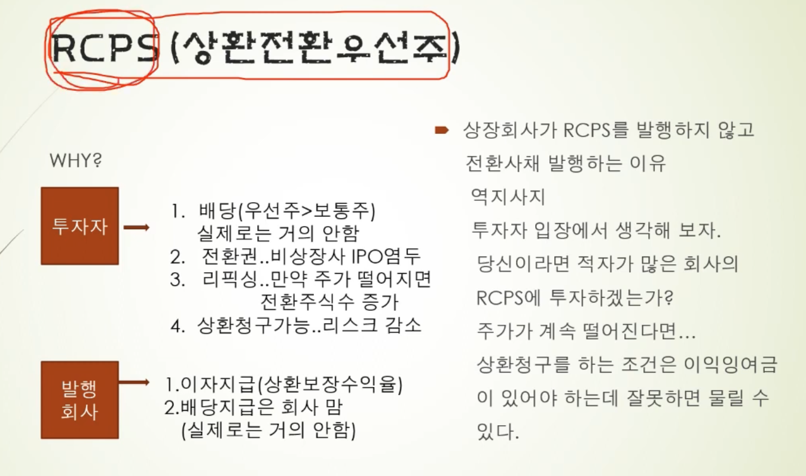

[링크](https://www.youtube.com/watch?v=ObY-GmaE9cU&list=PLuTjxn6xUhzqdQtVBzFi6G4VddsaIqK8M&index=24)

- 스팩 진행 하기 전에 본 영상을 보면 좋을 것 같다.
- 
  - 상환권
    - 내돈 돌려달라는 의미이다.
    - 상환권이 투자자에게 있으면 부채이다.
    - 상환권이 발행회사에 있으면 자본이다
  - 전환권
    - 우선주인데, 보통주로 전환 요청을 하는 것이다. 
  - 상환우선주
    - 상환의미는 투자한돈 돌려줘 이말이다. 우선주 임에도 상환은 부채로 될 수 있다.
    - 상환권이 투자자에게 있으면 부채, 발행회사에 있으면 자본이다
  - 상환전환우선주
    - 상환권과 전환권이 둘 다 있다.
    - 상환권이 투자자에게 있으면 부채, 발행회사에 있으면 자본이다
    - 전환권이 확정으로 정해져 있으면 자본으로 편입된다.
    - 전환권 조항에 리픽싱 조항이 있으면 부채로 간다.
  - 전환우선주
    - 우선주인데 보통주로 전환하는 것.
    - 자본 == 순자산(자산-부채=순자산)
  - RCPS 
    - 상환권이 투자자에게 있으며, 부채로 잡힌다.
    - 중소기업에서 성장성에 있는 회사에서 발행을 하며, VC, 사모펀드에서 투자를 한다.
    - 상환을 하면 우선주를 전환주로 전환하여 매각을 하여 투자금을 회수하는 전략을 취한다.
    - 상환은 가액, 기간, 방법, 주식수를 정관에 규정을 해야 한다.
    - 상환은 이익으로만 할 수 있기 때문에, 이익잉여금이 있어야 한다.

- 
  - 전환권으로 우선주를 보통주로 전환하여 투자금 회수
  - 상장회사가 RCPS가 아닌 전환사채를 발행하는 경우
    - 유상증자, 3자배정 유상증자, 회사채 도 안들어 올경우 전환사채 발행을 한다.
    - 적자회사에 RCPS 를 투자하는데 상환을 청구 할 경우 잉익잉여금이 없으면 돌려 받을 수 없게 된다.

## 2017년 상장 엠플러스
  - 상장전 2016년 엠플러스 
    - 
      - 차입금 내역에 전환상환우선주(CB) 가 있다.
    - 당기말에 주식으로 전환이 된 것을 알 수 있다.
    - 상장 전 회사는, IPO가 목표이기 때문에 배당이 거의 없다.

