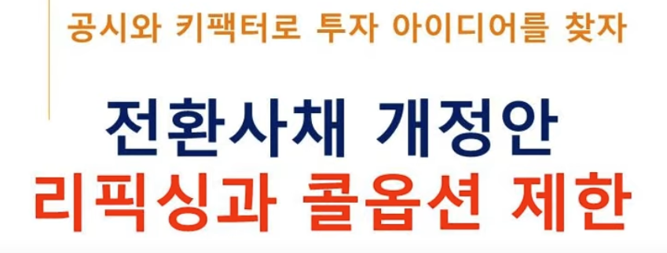
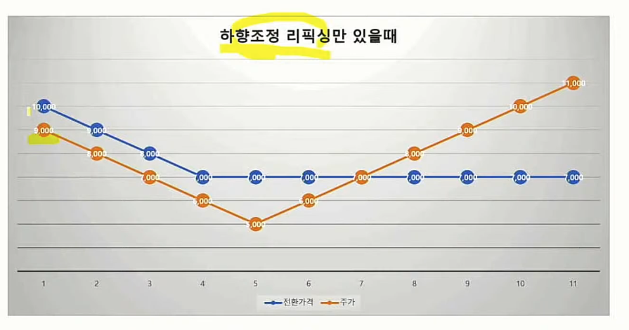

[링크](https://www.youtube.com/watch?v=YkH9XjYbyqY)
[링크](https://www.youtube.com/watch?v=RsVmHxwJfrw)
- 전환가액의 조정 (상향리픽싱)
- 
- 2022년 12월 01일 부터 시행되며, 규정 시행 이후 이사회가 발행을 결정한 CB 부터 적용된다.

- 전환가액 조정
  - 액면가까지 리픽싱이 조정이 가능하다면 스킵.

- 펀더맨털을 좀 더 고려해서 투자하게 될 것이다.

- 하향조정리픽싱
  - 
- 상향조정리픽싱
  - 

