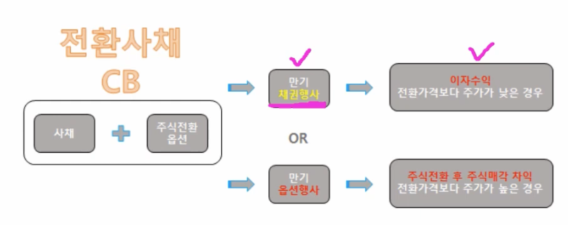
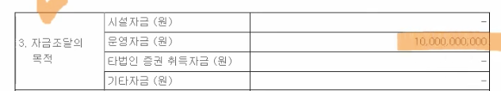
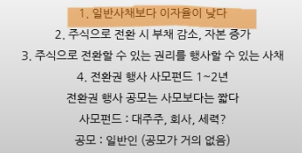
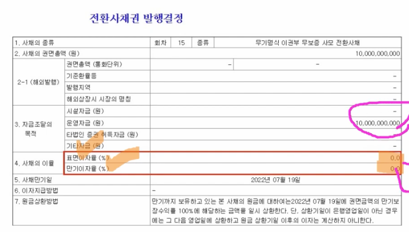
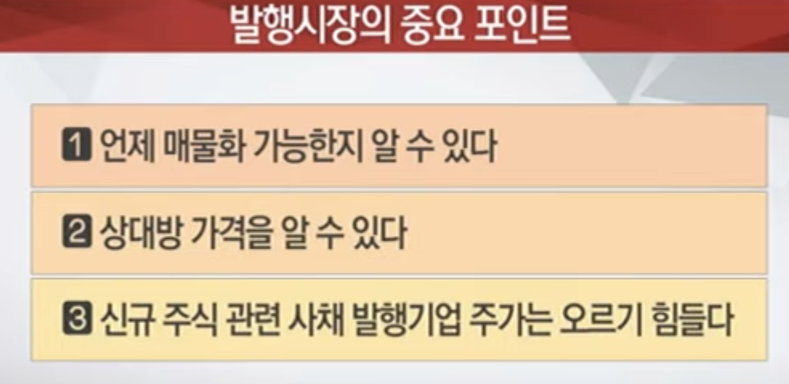
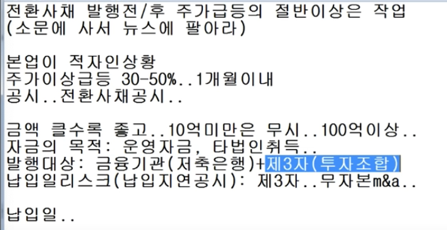
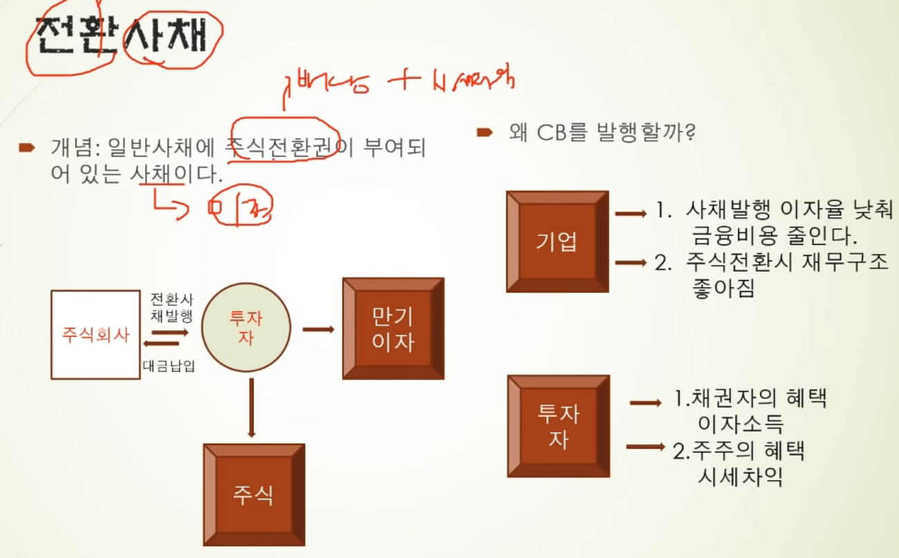

- 전환사채 발행 공시
- 전환청구권행사 공시
  - 권리행사 == 전환청구권행사







- 전환사채발행 공시가 최근에 나온 것이 어떤건지 미리 살펴보고, 전환청구권 기간이 임박하거나 끝나는 종목들이 어떤것들이 있는지 이런 종목들을 찾아서 매수 진행

- 전환사채의 전환권 행사 후에 는 부채가 회사의 자본금으로 편입이 되면서 신주 발행이 되게 된다.
  - https://www.stpharm.co.kr/ko/ir/notice/%EC%95%88%EB%82%B4-%EC%A0%84%ED%99%98%EC%82%AC%EC%B1%84%EC%9D%98-%EC%A0%84%ED%99%98%EA%B6%8C-%ED%96%89%EC%82%AC%EC%97%90-%EB%94%B0%EB%A5%B8-%EC%8B%A0%EC%A3%BC-%EC%B6%94%EA%B0%80%EC%83%81%EC%9E%A5

```
- 2020년 12월 11일 발행한 전환사채의 보유권자 일부로부터 전환사채를 보통주로 전환해 달라는 요청을 받았습니다.
- 전환권 행사 공시는 전환되는 주식의 지분율이 1% 이상이어야 공시하도록 되어 있으므로 한국거래소 권고 및 사전 협의를 통해 추가상장 안내만 진행하게 되었음을 양해하여 주시기 바랍니다.
- 1월 6일 추가로 상장되는 보통주는 152,775주로 기존 발행주식총수 대비 0.82%이며 추가상장 후 주식 수 18,808,775주 대비 0.81%입니다.
```

https://blog.naver.com/PostView.nhn?blogId=foryouheaven&logNo=221587033859&parentCategoryNo=&categoryNo=12&viewDate=&isShowPopularPosts=true&from=search

- 매수 포인트는 전환기간이 임박 했을때 이다

  - https://www.youtube.com/watch?v=0aSIwKLUIHQ

- 주식 매수하기 전에 발행(신주)이 될 수 있는 사채 물량을 확인해야 한다. (리픽싱 최저 한다로 갔을때 매수하는게 유리하다)

  - https://www.youtube.com/watch?v=ueAdrOADznI
  - 
  - 
  - 
  - 전환사채, 교환사채, 신주인수권부사채, 전환우선상환주 (발행가격이 확정되어 있음, 매자닌의 가격을 확인한다.)
  - 리픽싱 항목이 없는 것은 액면가까지 조정이 가능하기 때문이 피한다.

    - 

  - 누가 투자했는지
    - 리픽싱 항목이 없는 것은 액면가까지 조정이 가능하기 때문이 피한다.
